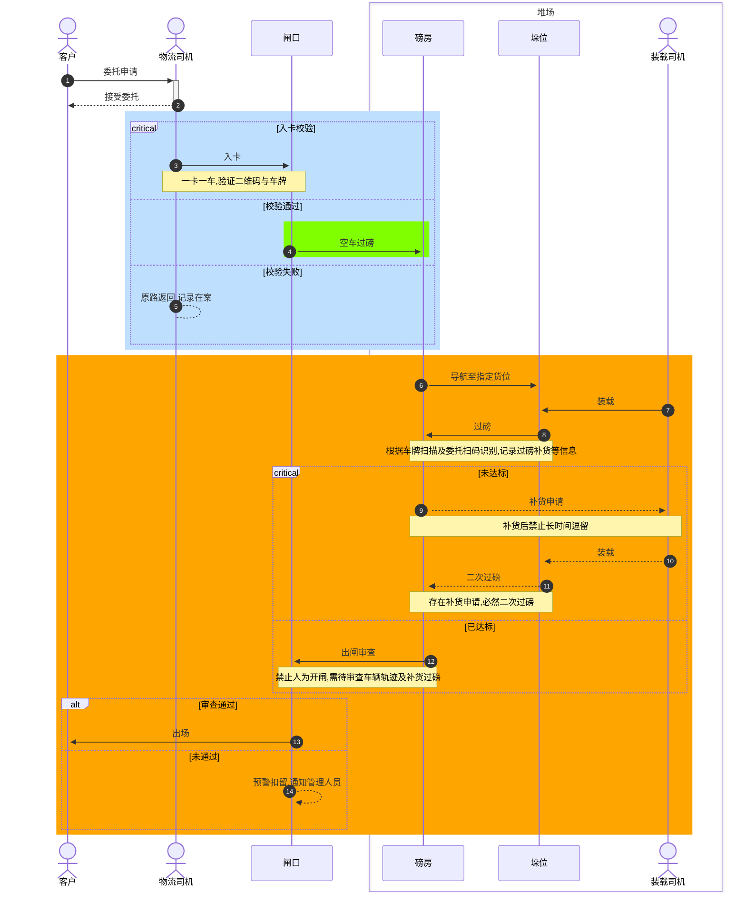

# 新圩港思路方案

关于堆场物流流程

我的建议

堆场物流偷货现象,主要原因是
1. 磅房闸口核心设施处于无人监管状态
2. 作业人员大都是临时工,难以管制
3. 作业流程存在漏洞,例如补货后不过磅

因此防止措施的核心思路:

- 外部技术
  1. 摄像监控
  2. 定位导航

- 软件
  - 出闸审查
    - 行车路线及作业垛位异常
    - 作业时间是否异常
  - 磅房校验
    - 补货,是否存在遗漏过磅

- 内部规制
  - 规划区分垛位(便于匹配)
  - 装载及补货后禁止长时间逗留
  - 禁止人为打开闸口
  - 如无必要,不得下车

